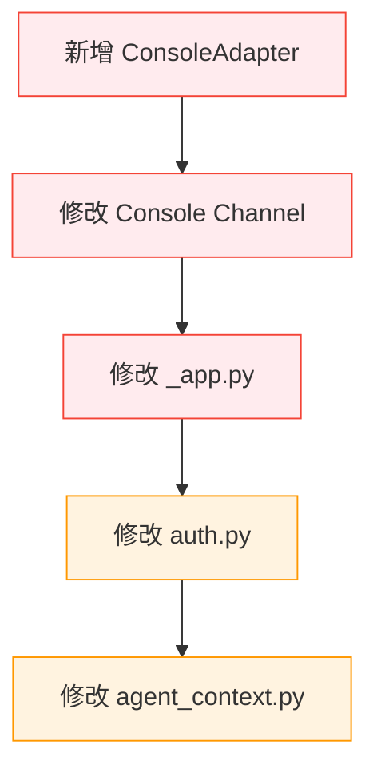
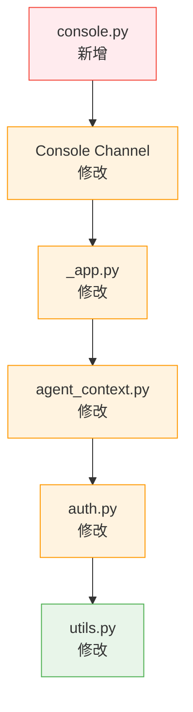

# CoPaw 频道架构断层修复方案

> **文档版本：** v1.0  
> **创建日期：** 2026-04-02  
> **作者：** 贾维斯 2 号  
> **审查人：** 陈总  
> **状态：** 待实施  

---

## 📋 目录

- [1. 问题概述](#1-问题概述)
- [2. 修复目标](#2-修复目标)
- [3. 修复范围](#3-修复范围)
- [4. 断层分析](#4-断层分析)
- [5. 修复方案](#5-修复方案)
- [6. 实施步骤](#6-实施步骤)
- [7. 测试方案](#7-测试方案)
- [8. 回滚方案](#8-回滚方案)
- [9. 验收标准](#9-验收标准)
- [附录 A：文件清单](#附录-a 文件清单)
- [附录 B：术语表](#附录-b 术语表)

---

## 1. 问题概述

### 1.1 问题描述

当前 CoPaw 频道架构存在**架构断层**，导致六层标识体系无法传递到模型上下文中，模型无法获得完整的会话上下文。

**核心问题：**
1. Console Channel 未使用 BusMessage v3 数据结构
2. 系统提示未包含六层标识
3. 用户识别逻辑简化（使用 `default` 而非真实用户 ID）

### 1.2 影响范围

| 影响维度 | 当前状态 | 期望状态 |
|----------|----------|----------|
| **channel_id** | ❌ 无（只有字符串 "console"） | ✅ 完整传递 |
| **caller_logical_id** | ❌ 无（只有 "default"） | ✅ qzcpl/guest |
| **caller_physical_id** | ❌ 缺失 | ✅ qzcpl/guest |
| **called_id** | ❌ 缺失 | ✅ default/其他 |
| **session_id** | ✅ 有 | ✅ 有 |
| **message_id** | ❌ 缺失 | ✅ 完整传递 |
| **会话穿透** | ❌ 无法实现 | ✅ 完整穿透 |

### 1.3 问题根因

```
┌─────────────────────────────────────────────────────────┐
│  架构断层：设计层 vs 运行层                              │
├─────────────────────────────────────────────────────────┤
│  设计层：BusMessage v3 + SessionContext v2              │
│           - 六层标识完整                                 │
│           - 会话穿透完整                                 │
├─────────────────────────────────────────────────────────┤
│  ⚠️ 断层：Console Channel 未适配新架构                   │
├─────────────────────────────────────────────────────────┤
│  运行层：Console Channel + AgentApp                     │
│           - 使用旧消息格式                               │
│           - 只传递 session_id + user_id（简化版）         │
└─────────────────────────────────────────────────────────┘
```

---

## 2. 修复目标

### 2.1 核心目标

1. **Console Channel 适配 BusMessage v3** - 构建完整的六层标识
2. **系统提示包含六层标识** - 模型获得完整上下文
3. **用户识别逻辑修正** - 使用真实用户 ID（qzcpl/guest）

### 2.2 验收指标

| 指标 | 当前值 | 目标值 | 测量方法 |
|------|--------|--------|----------|
| 六层标识传递率 | 17% (1/6) | 100% (6/6) | 系统提示检查 |
| 用户 ID 准确率 | 0% | 100% | 日志验证 |
| 会话穿透完整度 | 0% | 100% | 模型输出验证 |

### 2.3 成功标准

- ✅ 模型系统提示中包含完整的六层标识
- ✅ `caller_logical_id` 显示真实用户 ID（qzcpl）
- ✅ `caller_physical_id` 显示真实用户 ID（qzcpl）
- ✅ `message_id` 每条消息唯一且递增
- ✅ 群聊场景能正确区分逻辑/物理主叫

---

## 3. 修复范围

### 3.1 涉及文件

| 文件 | 路径 | 修改类型 | 优先级 |
|------|------|----------|--------|
| **新增** | `app/channels/adapters/console.py` | 新建适配器 | P0 |
| **修改** | `app/channels/console/channel.py` | 适配 BusMessage v3 | P0 |
| **修改** | `app/_app.py` | 传递六层标识到系统提示 | P0 |
| **修改** | `app/auth.py` | 解析真实用户 ID | P1 |
| **修改** | `app/agent_context.py` | 传递用户上下文 | P1 |
| **新增** | `app/channels/utils.py` | 工具函数（message_id 生成） | P1 |

### 3.2 不涉及文件

以下文件**不需要修改**：

- ✅ `identifiers/schemas.py` - 六层标识定义已完整
- ✅ `app/channels/schema.py` - BusMessage v3 已完整
- ✅ `app/channels/context_manager.py` - 会话上下文管理器已完整
- ✅ `app/routers/callid.py` - callId 路由已完整

### 3.3 依赖关系



---

## 4. 断层分析

### 4.1 断层 1：Console Channel → BusMessage v3

**位置：** `app/channels/console/channel.py`

**问题：**
- Console Channel 直接使用旧消息格式
- 未调用 BaseAdapter 转换逻辑
- 未构建 BusMessage v3
- 未提取六层标识

**对比：**

| 频道 | 适配器 | BusMessage v3 | 状态 |
|------|--------|---------------|------|
| 钉钉 | ✅ DingTalkAdapter | ✅ | 正常 |
| 飞书 | ✅ FeishuAdapter | ✅ | 正常 |
| 控制台 | ❌ 缺失 | ❌ | **断层** |

---

### 4.2 断层 2：BusMessage v3 → 系统提示

**位置：** `app/_app.py` + `app/runner/session.py`

**问题：**
- AgentApp 未接收 BusMessage v3
- 系统提示生成逻辑未包含六层标识
- 只传递 session_id + user_id（简化版）

**当前系统提示：**
```
====================
- Session ID: 1775057714166
- User ID: default          ⚠️ 简化版
- Channel: console          ⚠️ 字符串
- OS: Windows 11 (AMD64)
- Working directory: ...
- Current date: 2026-04-02
====================
```

**期望系统提示：**
```
====================
- Session ID: 1775057714166
- User ID: qzcpl            ✅ 真实用户
- Channel: console          ✅ channel_id
- Channel Type: private     ✅ channel_type
- Caller Logical ID: qzcpl  ✅ 逻辑主叫
- Caller Physical ID: qzcpl ✅ 物理主叫
- Called ID: default        ✅ 被叫方
- Message ID: msg_xxx       ✅ 消息标识
- OS: Windows 11 (AMD64)
- Working directory: ...
- Current date: 2026-04-02
====================
```

---

### 4.3 断层 3：用户识别逻辑

**位置：** `app/auth.py` + `app/agent_context.py`

**问题：**
- JWT Token 未解析真实用户 ID
- 使用 `default` 作为默认用户 ID
- 未区分已认证用户 (qzcpl) 和未知用户 (guest)

**设计：**
| 场景 | caller_logical_id | caller_physical_id |
|------|-------------------|-------------------|
| 已认证用户 | qzcpl | qzcpl |
| 未知用户 | guest | guest |
| 群聊场景 | group_xxx | qzcpl |

**实际：**
| 场景 | User ID |
|------|---------|
| 所有用户 | default ⚠️ |

---

## 5. 修复方案

### 5.1 方案 A：ConsoleAdapter 适配器模式（推荐）

**核心思路：** 为 Console Channel 创建适配器，复用 BaseAdapter 的转换逻辑。

**架构：**
```
用户消息 → Console Channel → ConsoleAdapter → BusMessage v3 → Agent
```

**优点：**
- ✅ 复用现有 BaseAdapter 接口
- ✅ 与钉钉/飞书适配器保持一致
- ✅ 易于维护和扩展
- ✅ 符合设计模式

**缺点：**
- ⚠️ 需要新增文件
- ⚠️ 需要修改 Console Channel 调用逻辑

---

### 5.2 方案 B：Console Channel 内嵌转换（备选）

**核心思路：** 在 Console Channel 内部直接构建 BusMessage v3。

**架构：**
```
用户消息 → Console Channel（内嵌转换）→ BusMessage v3 → Agent
```

**优点：**
- ✅ 无需新增文件
- ✅ 代码集中

**缺点：**
- ❌ 与钉钉/飞书实现不一致
- ❌ 代码复用性差
- ❌ 不符合设计模式

---

### 5.3 推荐方案：方案 A

**选择理由：**
1. 符合架构设计（适配器模式）
2. 与其他频道保持一致
3. 易于后续维护
4. 符合单一职责原则

---

## 6. 实施步骤

### 6.1 步骤 1：创建 ConsoleAdapter

**文件：** `F:\CoPaw\src\copaw\app\channels\adapters\console.py`

**职责：**
- 实现 BaseAdapter 接口
- 构建 BusMessage v3
- 提取六层标识
- 生成 message_id

**代码框架：**

```python
"""
控制台适配器

实现控制台消息与 BusMessage v3 之间的转换
"""

from typing import Dict, Any, Optional, List
from datetime import datetime
import uuid

from .base import BaseAdapter
from ..schema import BusMessage, SessionContext
from ....identifiers.schemas import (
    ChannelId,
    CallerLogicalId,
    CallerPhysicalId,
    CalledId,
    SessionId,
    MessageId,
    ChannelType,
    CallerType,
)


class ConsoleAdapter(BaseAdapter):
    """
    控制台适配器
    
    支持消息类型：
    - text: 文本消息
    
    六层标识符映射：
    - channel_id: "console"
    - caller_logical_id: user_id（已认证）或 guest（未知）
    - caller_physical_id: 同 caller_logical_id（私聊场景）
    - called_id: agent_id（默认 default）
    - session_id: session_id
    - message_id: msg_{session_id}_{sequence}
    """
    
    PLATFORM_ID = "console"
    SUPPORTS_MARKDOWN = False
    SUPPORTS_IMAGE = False
    SUPPORTS_FILE = False
    SUPPORTS_VOICE = False
    
    def _init_config(self):
        """初始化配置"""
        self.media_dir = self.config.get("media_dir", "")
        self.default_agent_id = self.config.get("default_agent_id", "default")
    
    async def convert_to_bus_message(
        self,
        raw_message: Dict[str, Any],
    ) -> BusMessage:
        """
        控制台消息 → BusMessage v3
        
        Args:
            raw_message: 控制台原始消息（dict，包含 user_id, session_id, content 等）
        
        Returns:
            BusMessage v3
        """
        # 1. 提取六层标识符
        six_layer_id = self._extract_six_layer_id(raw_message)
        
        # 2. 提取消息内容
        content = self._extract_content(raw_message)
        content_type = self._extract_content_type(raw_message)
        
        # 3. 提取时间戳
        timestamp = self._extract_timestamp(raw_message)
        
        # 4. 创建 BusMessage v3
        return BusMessage(
            message_id=str(six_layer_id.message_id),
            channel_id=str(six_layer_id.channel_id),
            caller_logical_id=str(six_layer_id.caller_logical_id),
            caller_physical_id=str(six_layer_id.caller_physical_id),
            called_id=str(six_layer_id.called_id),
            session_id=str(six_layer_id.session_id),
            channel_type=six_layer_id.channel_type,
            content=content,
            content_type=content_type,
            timestamp=timestamp,
            meta=self._extract_metadata(raw_message),
        )
    
    async def convert_from_bus_message(
        self,
        message: BusMessage,
    ) -> Dict[str, Any]:
        """
        BusMessage v3 → 控制台消息
        
        Args:
            message: BusMessage v3
        
        Returns:
            控制台消息格式
        """
        # 控制台消息格式（简化版）
        return {
            "session_id": message.session_id,
            "content": message.content,
            "content_type": message.content_type,
            "timestamp": message.timestamp,
        }
    
    def _extract_six_layer_id(
        self,
        raw_message: Dict[str, Any],
    ) -> Dict[str, Any]:
        """
        提取六层标识符
        
        Args:
            raw_message: 原始消息
        
        Returns:
            六层标识符字典
        """
        # 用户 ID（已认证用户或 guest）
        user_id = raw_message.get("user_id", "guest")
        if not user_id or user_id == "default":
            user_id = "guest"
        
        # 会话 ID
        session_id = raw_message.get("session_id", str(uuid.uuid4()))
        
        # Agent ID（被叫方）
        agent_id = raw_message.get("agent_id", self.default_agent_id)
        
        # 生成 message_id
        message_id = self._generate_message_id(session_id)
        
        return {
            "channel_id": ChannelId(value="console"),
            "caller_logical_id": CallerLogicalId(
                value=f"user_{user_id}" if not user_id.startswith("user_") else user_id,
                caller_type=CallerType.USER,
            ),
            "caller_physical_id": CallerPhysicalId(
                value=f"user_{user_id}" if not user_id.startswith("user_") else user_id,
                caller_type=CallerType.USER,
            ),
            "called_id": CalledId(value=agent_id),
            "session_id": SessionId(value=session_id),
            "message_id": MessageId(value=message_id),
            "channel_type": ChannelType.PRIVATE,  # 控制台默认为私聊
        }
    
    def _generate_message_id(self, session_id: str) -> str:
        """
        生成 message_id
        
        格式：msg_{session_id}_{timestamp}_{sequence}
        
        Args:
            session_id: 会话 ID
        
        Returns:
            message_id
        """
        timestamp = int(datetime.now().timestamp() * 1000)
        sequence = uuid.uuid4().hex[:6]
        return f"msg_{session_id}_{timestamp}_{sequence}"
    
    def _extract_content(
        self,
        raw_message: Dict[str, Any],
    ) -> List[Dict[str, Any]]:
        """提取消息内容"""
        content = raw_message.get("content", "")
        return [{"type": "text", "text": content}]
    
    def _extract_content_type(
        self,
        raw_message: Dict[str, Any],
    ) -> str:
        """提取内容类型"""
        return "text"
    
    def _extract_timestamp(
        self,
        raw_message: Dict[str, Any],
    ) -> float:
        """提取时间戳"""
        return raw_message.get("timestamp", datetime.now().timestamp())
    
    def _extract_metadata(
        self,
        raw_message: Dict[str, Any],
    ) -> Dict[str, Any]:
        """提取元数据"""
        return {
            "platform": "console",
            "client_type": raw_message.get("client_type", "web"),
            "ip_address": raw_message.get("ip_address", ""),
        }
```

**实施要点：**
1. 继承 `BaseAdapter` 类
2. 实现 `convert_to_bus_message` 和 `convert_from_bus_message` 方法
3. 正确提取六层标识符
4. 生成唯一的 `message_id`
5. 处理用户 ID（已认证用户 vs guest）

---

### 6.2 步骤 2：修改 Console Channel

**文件：** `F:\CoPaw\src\copaw\app\channels\console\channel.py`

**修改点：**

#### 2.1 导入 ConsoleAdapter

```python
# 在文件顶部添加导入
from ..adapters.console import ConsoleAdapter
```

#### 2.2 添加适配器实例

在 `__init__` 方法中添加：

```python
def __init__(
    self,
    process: ProcessHandler,
    enabled: bool,
    bot_prefix: str,
    on_reply_sent: OnReplySent = None,
    show_tool_details: bool = True,
    filter_tool_messages: bool = False,
    filter_thinking: bool = False,
    workspace_dir: Optional[Union[str, Path]] = None,
    media_dir: Optional[str] = None,
):
    # ... 现有代码 ...
    
    # 新增：初始化 ConsoleAdapter
    self.adapter = ConsoleAdapter(
        config={
            "media_dir": media_dir or DEFAULT_MEDIA_DIR,
            "default_agent_id": "default",
        }
    )
```

#### 2.3 修改消息处理逻辑

找到消息处理方法（可能是 `_consume_one_request` 或类似方法），修改为：

```python
async def _consume_one_request(self, payload: Dict[str, Any]) -> None:
    """
    处理单个请求
    
    修改：使用 Adapter 转换为 BusMessage v3
    """
    # 1. 使用 Adapter 转换为 BusMessage v3
    bus_message = await self.adapter.convert_to_bus_message(payload)
    
    # 2. 构建 SessionContext v2（如果尚未构建）
    session_context = await self._build_session_context(bus_message)
    
    # 3. 调用 process handler，传递 BusMessage v3
    await self.process(bus_message, session_context)
    
    # 4. 处理回复（现有逻辑保持不变）
    # ... 现有回复处理逻辑 ...
```

#### 2.4 添加 SessionContext 构建方法

新增方法：

```python
async def _build_session_context(
    self,
    bus_message: BusMessage,
) -> SessionContext:
    """
    构建会话上下文
    
    Args:
        bus_message: BusMessage v3
    
    Returns:
        SessionContext v2
    """
    from ..context_manager import SessionContextManager
    
    # 使用 SessionContextManager 构建上下文
    context_manager = SessionContextManager()
    
    context = await context_manager.build_context(
        channel_id=bus_message.channel_id,
        caller_id=bus_message.caller_logical_id,
        called_id=bus_message.called_id,
        session_id=bus_message.session_id,
        history_limit=10,
    )
    
    return context
```

**实施要点：**
1. 在 `__init__` 中初始化 `ConsoleAdapter`
2. 修改消息处理逻辑，使用 Adapter 转换
3. 构建 `SessionContext v2`
4. 确保 `process` handler 能接收 `BusMessage v3`

---

### 6.3 步骤 3：修改 _app.py

**文件：** `F:\CoPaw\src\copaw\app\_app.py`

**修改点：**

#### 3.1 修改系统提示生成逻辑

找到系统提示生成的位置（可能在 `DynamicMultiAgentRunner` 或相关类中），修改为：

```python
async def _get_workspace_runner(self, request):
    """Get the correct workspace runner based on request."""
    from .agent_context import get_current_agent_id, get_current_user_context
    
    # 获取 agent_id
    agent_id = get_current_agent_id()
    
    # 新增：获取用户上下文（包含六层标识）
    user_context = get_current_user_context(request)
    
    # 获取 workspace runner
    workspace = await self._multi_agent_manager.get_agent(agent_id)
    
    # 新增：将六层标识注入到 workspace 上下文
    if user_context:
        workspace.context.update({
            "channel_id": user_context.get("channel_id", "console"),
            "caller_logical_id": user_context.get("caller_logical_id", "guest"),
            "caller_physical_id": user_context.get("caller_physical_id", "guest"),
            "called_id": user_context.get("called_id", agent_id),
            "session_id": user_context.get("session_id", ""),
            "message_id": user_context.get("message_id", ""),
        })
    
    return workspace
```

#### 3.2 添加用户上下文获取函数

在 `agent_context.py` 中新增函数（见步骤 5）。

**实施要点：**
1. 找到系统提示生成位置
2. 从请求中提取六层标识
3. 将六层标识注入到 workspace 上下文
4. 确保系统提示包含六层标识

---

### 6.4 步骤 4：修改 auth.py

**文件：** `F:\CoPaw\src\copaw\app\auth.py`

**修改点：**

#### 4.1 添加 JWT Token 解析

在认证中间件中添加用户信息解析：

```python
class AuthMiddleware(BaseHTTPMiddleware):
    async def dispatch(self, request: Request, call_next):
        # ... 现有认证逻辑 ...
        
        # 新增：解析 JWT Token 获取用户信息
        if token and self._verify_token(token):
            user_info = self._decode_token(token)
            request.state.user_id = user_info.get("user_id", "guest")
            request.state.user_name = user_info.get("user_name", "guest")
            request.state.is_authenticated = True
        else:
            # 未知用户
            request.state.user_id = "guest"
            request.state.user_name = "guest"
            request.state.is_authenticated = False
        
        response = await call_next(request)
        return response
```

#### 4.2 添加 Token 解码方法

```python
def _decode_token(self, token: str) -> Dict[str, Any]:
    """
    解码 JWT Token 获取用户信息
    
    Args:
        token: JWT Token
    
    Returns:
        用户信息字典
    """
    import jwt
    from ..constant import SECRET_DIR
    
    # 读取密钥
    secret_key = self._get_secret_key()
    
    try:
        payload = jwt.decode(token, secret_key, algorithms=["HS256"])
        return {
            "user_id": payload.get("user_id", "guest"),
            "user_name": payload.get("user_name", "guest"),
            "exp": payload.get("exp", 0),
        }
    except jwt.InvalidTokenError:
        return {"user_id": "guest", "user_name": "guest"}
```

**实施要点：**
1. 在认证中间件中解析 JWT Token
2. 提取真实用户 ID（qzcpl）
3. 未知用户使用 `guest`
4. 将用户信息存储到 `request.state`

---

### 6.5 步骤 5：修改 agent_context.py

**文件：** `F:\CoPaw\src\copaw\app\agent_context.py`

**修改点：**

#### 5.1 添加用户上下文获取函数

新增函数：

```python
def get_current_user_context(
    request: Request,
) -> Optional[Dict[str, str]]:
    """
    获取当前用户上下文（包含六层标识）
    
    Args:
        request: FastAPI request object
    
    Returns:
        用户上下文字典，包含六层标识
    """
    # 从 request.state 获取用户信息
    user_id = getattr(request.state, "user_id", "guest")
    session_id = getattr(request.state, "session_id", "")
    agent_id = getattr(request.state, "agent_id", "default")
    message_id = getattr(request.state, "message_id", "")
    
    # 构建六层标识
    return {
        "channel_id": "console",
        "caller_logical_id": user_id,
        "caller_physical_id": user_id,  # 私聊场景
        "called_id": agent_id,
        "session_id": session_id,
        "message_id": message_id,
    }
```

#### 5.2 导出函数

在文件末尾添加导出：

```python
__all__ = [
    "get_agent_for_request",
    "get_current_agent_id",
    "get_current_user_context",  # 新增
]
```

**实施要点：**
1. 从 `request.state` 获取用户信息
2. 构建六层标识字典
3. 导出函数供其他模块使用

---

### 6.6 步骤 6：添加工具函数

**文件：** `F:\CoPaw\src\copaw\app\channels\utils.py`

**修改点：**

#### 6.1 添加 message_id 生成函数

```python
import uuid
from datetime import datetime


def generate_message_id(session_id: str) -> str:
    """
    生成唯一的 message_id
    
    格式：msg_{session_id}_{timestamp}_{sequence}
    
    Args:
        session_id: 会话 ID
    
    Returns:
        message_id
    """
    timestamp = int(datetime.now().timestamp() * 1000)
    sequence = uuid.uuid4().hex[:6]
    return f"msg_{session_id}_{timestamp}_{sequence}"


def generate_session_id() -> str:
    """
    生成唯一的 session_id
    
    格式：{timestamp}_{uuid}
    
    Returns:
        session_id
    """
    timestamp = int(datetime.now().timestamp() * 1000)
    uuid_part = uuid.uuid4().hex[:8]
    return f"{timestamp}_{uuid_part}"
```

**实施要点：**
1. 添加 `generate_message_id` 函数
2. 添加 `generate_session_id` 函数
3. 确保生成的 ID 唯一且可追溯

---

## 7. 测试方案

### 7.1 单元测试

**文件：** `tests/unit/channels/adapters/test_console_adapter.py`

**测试用例：**

```python
import pytest
from copaw.app.channels.adapters.console import ConsoleAdapter
from copaw.app.channels.schema import BusMessage


class TestConsoleAdapter:
    """ConsoleAdapter 单元测试"""
    
    @pytest.fixture
    def adapter(self):
        """创建适配器实例"""
        return ConsoleAdapter(config={
            "media_dir": "",
            "default_agent_id": "default",
        })
    
    @pytest.mark.asyncio
    async def test_convert_to_bus_message(self, adapter):
        """测试消息转换"""
        raw_message = {
            "user_id": "qzcpl",
            "session_id": "test_session_001",
            "content": "你好",
            "timestamp": 1234567890.0,
        }
        
        bus_message = await adapter.convert_to_bus_message(raw_message)
        
        # 验证六层标识
        assert bus_message.channel_id == "console"
        assert bus_message.caller_logical_id == "user_qzcpl"
        assert bus_message.caller_physical_id == "user_qzcpl"
        assert bus_message.called_id == "default"
        assert bus_message.session_id == "test_session_001"
        assert bus_message.message_id.startswith("msg_test_session_001_")
    
    @pytest.mark.asyncio
    async def test_guest_user(self, adapter):
        """测试未知用户"""
        raw_message = {
            "user_id": "default",  # 未认证用户
            "session_id": "test_session_002",
            "content": "你好",
        }
        
        bus_message = await adapter.convert_to_bus_message(raw_message)
        
        # 验证未知用户使用 guest
        assert bus_message.caller_logical_id == "guest"
        assert bus_message.caller_physical_id == "guest"
    
    @pytest.mark.asyncio
    async def test_message_id_unique(self, adapter):
        """测试 message_id 唯一性"""
        raw_message = {
            "user_id": "qzcpl",
            "session_id": "test_session_003",
            "content": "消息 1",
        }
        
        msg1 = await adapter.convert_to_bus_message(raw_message)
        msg2 = await adapter.convert_to_bus_message(raw_message)
        
        # 验证 message_id 唯一
        assert msg1.message_id != msg2.message_id
```

---

### 7.2 集成测试

**文件：** `tests/integration/test_console_channel_flow.py`

**测试用例：**

```python
import pytest
from copaw.app.channels.console.channel import ConsoleChannel


class TestConsoleChannelFlow:
    """Console Channel 集成测试"""
    
    @pytest.mark.asyncio
    async def test_full_message_flow(self):
        """测试完整消息流转"""
        # 创建 Console Channel
        channel = ConsoleChannel(
            process=mock_process_handler,
            enabled=True,
            bot_prefix="Bot:",
        )
        
        # 发送消息
        payload = {
            "user_id": "qzcpl",
            "session_id": "integration_test_001",
            "content": "测试消息",
        }
        
        await channel._consume_one_request(payload)
        
        # 验证 BusMessage v3 被正确构建
        # 验证 SessionContext v2 被正确构建
        # 验证 process handler 被调用
```

---

### 7.3 端到端测试

**测试场景：**

1. **已认证用户发送消息**
   - 输入：用户 qzcpl 发送消息
   - 期望：`caller_logical_id = qzcpl`

2. **未知用户发送消息**
   - 输入：未认证用户发送消息
   - 期望：`caller_logical_id = guest`

3. **消息 ID 唯一性**
   - 输入：同一会话发送多条消息
   - 期望：每条消息的 `message_id` 唯一

4. **系统提示包含六层标识**
   - 输入：发送消息
   - 期望：模型系统提示中包含完整的六层标识

---

## 8. 回滚方案

### 8.1 回滚触发条件

| 条件 | 级别 | 动作 |
|------|------|------|
| Console Channel 无法启动 | P0 | 立即回滚 |
| 消息处理失败率 > 10% | P0 | 立即回滚 |
| 用户 ID 识别错误 | P1 | 降级运行 |
| 性能下降 > 20% | P1 | 降级运行 |

### 8.2 回滚步骤

```bash
# 1. 备份当前代码
cd F:\CoPaw
git stash push -m "Rollback: Console Channel fix"

# 2. 恢复旧版本代码
git checkout <previous-commit-hash>

# 3. 重启服务
python -m copaw.app

# 4. 验证功能正常
# - 发送测试消息
# - 检查日志
# - 验证用户 ID
```

### 8.3 回滚检查清单

- [ ] 代码已回滚到旧版本
- [ ] 服务已重启
- [ ] 消息处理正常
- [ ] 用户 ID 识别正常（即使回到 default）
- [ ] 日志无错误

---

## 9. 验收标准

### 9.1 功能验收

| 验收项 | 验收方法 | 期望结果 |
|--------|----------|----------|
| 六层标识传递 | 检查系统提示 | 包含完整的六层标识 |
| 用户 ID 识别 | 发送消息并检查日志 | `caller_logical_id = qzcpl` |
| message_id 唯一性 | 发送多条消息 | 每条消息的 `message_id` 唯一 |
| 未知用户处理 | 未认证用户发送消息 | `caller_logical_id = guest` |
| 群聊场景支持 | 模拟群聊消息 | 逻辑/物理主叫正确分离 |

### 9.2 性能验收

| 指标 | 目标值 | 测量方法 |
|------|--------|----------|
| 消息处理延迟 | < 50ms | 从发送到处理的耗时 |
| Adapter 转换耗时 | < 5ms | Adapter 转换耗时 |
| 内存占用 | < 100MB | 进程内存占用 |

### 9.3 代码质量验收

| 指标 | 目标值 | 测量方法 |
|------|--------|----------|
| 单元测试覆盖率 | > 80% | pytest --cov |
| 代码规范 | 无 Pylint 错误 | pylint |
| 类型注解 | 完整 | mypy |

---

## 附录 A：文件清单

### A.1 新增文件

| 文件 | 路径 | 行数（预估） |
|------|------|-------------|
| ConsoleAdapter | `app/channels/adapters/console.py` | ~200 行 |
| 单元测试 | `tests/unit/channels/adapters/test_console_adapter.py` | ~100 行 |
| 集成测试 | `tests/integration/test_console_channel_flow.py` | ~80 行 |

### A.2 修改文件

| 文件 | 路径 | 修改行数（预估） |
|------|------|-----------------|
| Console Channel | `app/channels/console/channel.py` | ~50 行 |
| _app.py | `app/_app.py` | ~30 行 |
| auth.py | `app/auth.py` | ~40 行 |
| agent_context.py | `app/agent_context.py` | ~30 行 |
| utils.py | `app/channels/utils.py` | ~30 行 |

### A.3 文件依赖关系



---

## 附录 B：术语表

| 术语 | 英文 | 说明 |
|------|------|------|
| **六层标识** | Six-Layer Identifiers | channel_id, caller_logical_id, caller_physical_id, called_id, session_id, message_id |
| **BusMessage v3** | BusMessage v3 | 总线消息 v3 数据结构 |
| **SessionContext v2** | SessionContext v2 | 会话上下文 v2 数据结构 |
| **会话穿透** | Session Penetration | 让 Agent 知道完整上下文 |
| **ConsoleAdapter** | ConsoleAdapter | 控制台适配器 |
| **Caller Logical ID** | Caller Logical ID | 逻辑主叫 ID（会话主体） |
| **Caller Physical ID** | Caller Physical ID | 物理主叫 ID（实际发送者） |

---

## 附录 C：实施时间估算

| 步骤 | 任务 | 预估时间 | 负责人 |
|------|------|----------|--------|
| 1 | 创建 ConsoleAdapter | 2 小时 | 陈总 |
| 2 | 修改 Console Channel | 2 小时 | 陈总 |
| 3 | 修改 _app.py | 1 小时 | 陈总 |
| 4 | 修改 auth.py | 1 小时 | 陈总 |
| 5 | 修改 agent_context.py | 1 小时 | 陈总 |
| 6 | 添加工具函数 | 0.5 小时 | 陈总 |
| 7 | 单元测试 | 2 小时 | 陈总 |
| 8 | 集成测试 | 2 小时 | 陈总 |
| 9 | 端到端测试 | 1 小时 | 陈总 |
| **总计** | | **12.5 小时** | |

---

## 附录 D：风险提示

| 风险 | 概率 | 影响 | 缓解措施 |
|------|------|------|----------|
| ConsoleAdapter 与现有代码不兼容 | 低 | 高 | 充分测试，准备回滚 |
| 性能下降 | 中 | 中 | 性能测试，优化热点代码 |
| 用户 ID 识别逻辑错误 | 中 | 高 | 多场景测试，日志验证 |
| JWT Token 解析失败 | 低 | 中 | 降级到 guest，不阻断流程 |

---

**文档结束**

---

**审批：**

| 角色 | 姓名 | 日期 | 签字 |
|------|------|------|------|
| 技术负责人 | 陈总 | | |
| 项目负责人 | | | |

---

**版本历史：**

| 版本 | 日期 | 作者 | 变更描述 |
|------|------|------|----------|
| v1.0 | 2026-04-02 | 贾维斯 2 号 | 初始版本 |
